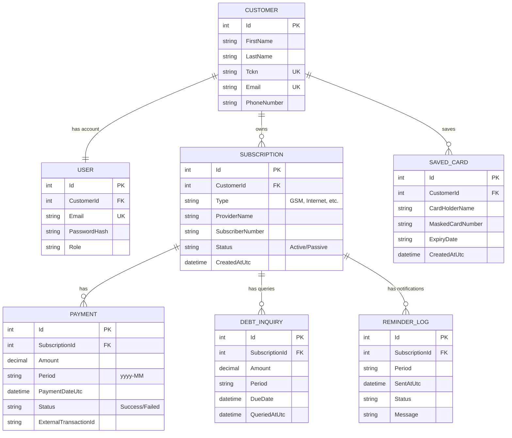
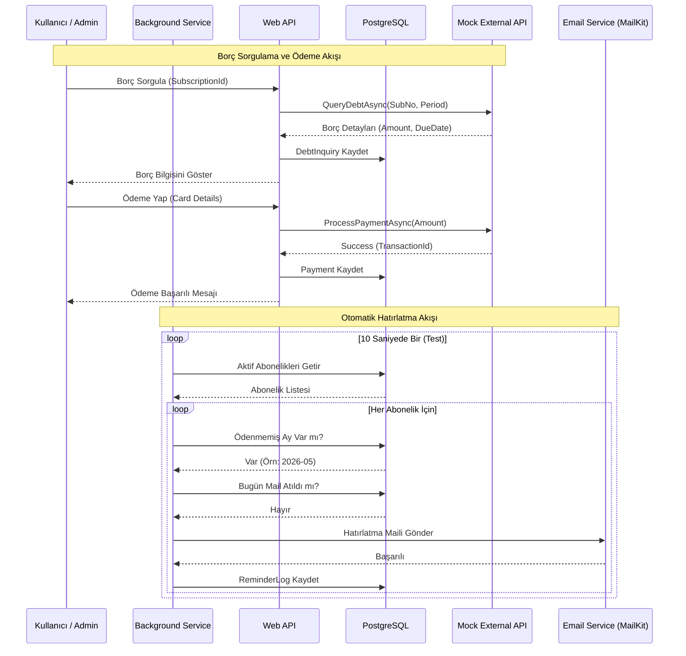

# 📝 Proje Teknik Dokümantasyonu

Bu doküman, **Abonelik & Otomatik Ödeme Hatırlatıcı** projesinin mimarisini, veri yapısını ve iş akışlarını detaylandırmaktadır.

---

## 1. ER Diagram (Varlık İlişki Diyagramı)

Sistem; müşteriler, kullanıcılar, abonelikler ve bu aboneliklere bağlı ödeme/hatırlatma kayıtları üzerine kuruludur.

---

## 2. API Endpoint Listesi

Uygulama RESTful prensiplerine uygun olarak tasarlanmıştır. Tüm endpointler (Auth hariç) `Bearer Token` gerektirir.

### 🔐 Kimlik Doğrulama (Auth)
- `POST /api/Auth/register` - Yeni kullanıcı kaydı.
- `POST /api/Auth/login` - Giriş ve JWT token üretimi.

### 👥 Müşteri Yönetimi (Customers)
- `GET /api/Customers` - Tüm müşterileri listeler (Admin).
- `GET /api/Customers/{id}` - Müşteri detayı.
- `POST /api/Customers` - Yeni müşteri oluşturur.
- `DELETE /api/Customers/me` - Mevcut kullanıcının hesabını ve tüm verilerini siler.
- `POST /api/Customers/update-password` - Şifre değiştirme işlemi.

### 📡 Abonelik Yönetimi (Subscriptions)
- `POST /api/Subscriptions` - Yeni abonelik tanımlar.
- `GET /api/Subscriptions/customer/{customerId}` - Müşterinin aboneliklerini getirir.
- `PUT /api/Subscriptions/{id}` - Abonelik günceller.
- `DELETE /api/Subscriptions/{id}` - Abonelik siler (Cascading).

### 💸 Borç ve Ödeme (Inquiries & Payments)
- `POST /api/DebtInquiries/{id}/query` - Anlık borç sorgular (External Mock API).
- `GET /api/DebtInquiries/{id}/status/{period}` - Belirli bir ayın ödeme durumunu sorgular.
- `POST /api/Payments` - Ödeme gerçekleştirir (External Mock API).
- `GET /api/Payments/history` - Kullanıcının tüm ödeme geçmişini getirir.
- `GET /api/Summaries/dashboard` - Genel istatistikleri getirir.
- `GET /api/Summaries/unpaid` - Ödenmemiş faturaları listeler.
- `GET /api/Summaries/reminder-logs` - Giden son hatırlatma maillerini listeler.

---

## 3. İş Akış Diyagramı

Borç sorgulama, ödeme ve otomatik hatırlatma süreçlerinin uçtan uca akışı:

